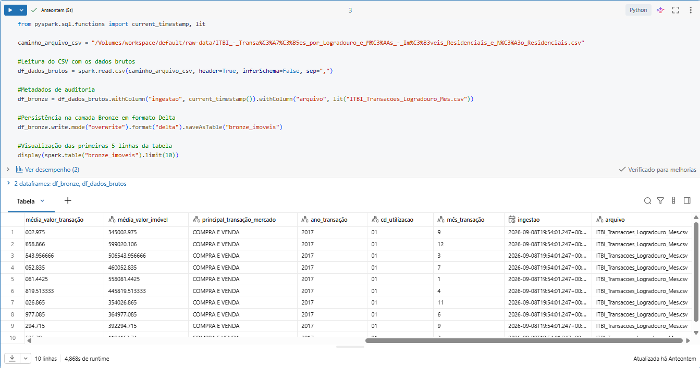

# MVP - Sprint: Engenharia de Dados

**Nome Completo:** Raphael Morgado Rosenburg Henriques  
**Matrícula:** 4052026001014  
**Link para a base de dados utilizada:** https://datariov2-pcrj.hub.arcgis.com/datasets/PCRJ::itbi-transa%C3%A7%C3%B5es-por-logradouro-e-m%C3%AAs-im%C3%B3veis-residenciais-e-n%C3%A3o-residenciais/about

O presente projeto apresenta uma pipeline de dados ponta a ponta construído com base na arquitetura Medalhão, desenvolvida na ferramenta Databricks, utilizando PySpark, Delta Lake e Unity Catalog. O projeto trata desde a ingestão dos dados à análise dos mesmos, que representam transações imobiliárias reais do município do Rio de Janeiro desde 2010, disponibilizados pela própria prefeitura do Rio de Janeiro.

## 1. Contexto de Negócio e Perguntas (Etapa 2 e 4.1)

O mercado imobiliário do Rio de Janeiro movimenta bilhões de reais anualmente, gerando um volume expressivo de registros de Imposto sobre a Transmissão de Bens Imóveis (ITBI), este que é um tributo municipal que é recolhido no momento da transferência de bens imóveis na cidade do Rio de Janeiro.

O processamento desses dados nos permite compreender o dinamismo econômico urbano, mapear oscilações de valores de mercado, fornecer informações analíticas importantes para auxiliar na tomada de decisões corporativas e governamentais, entre outros.

### 1.1. Perguntas de Negócio

Para guiar o andamento do projeto e auxiliar na modelagem dimensional, foram formuladas 5 perguntas de negócio: 

1. **Quais são os 10 bairros com maior volume de transações registradas no município do Rio de Janeiro?**
2. **Quais são os 10 bairros com o valor médio de transação imobiliária mais elevado?**
3. **Como o volume e o montante financeiro das transações imobiliárias evoluíram historicamente ano a ano no Rio de Janeiro?**
4. **Qual tipologia construtiva (Apartamento, Casa, Sala/Loja) e finalidade de uso (Residencial vs. Comercial) dominam o mercado carioca?**
5. **Qual é o valor médio transacionado de apartamentos residenciais nos bairros que concentram o maior volume de vendas dessa categoria?**

### 1.2. Estrutura dos Dados Brutos 

| Coluna | Descrição |
| :--- | :--- | 
| 'objectid' | Identificador do registro |
| 'cl' | Código do Logradouro |
| 'logradouro' | Nome da via pública municipal (rua, avenida, etc...) |
| 'codbairro' | Código cadastral do bairro | 
| 'bairro' | Nome oficial do bairro no município |
| 'total_transações' | Volume total de transações registradas no especificado logradouro/período |
| 'uso' | Finalidade de uso declarada (Residencial, Não Residencial) |
| 'principais_tipologias' | Classificação do padrão físico do imóvel (Apartamento, Casa, Sala, Galpão, Loja, etc...) |
| 'média_percentual_transferido' | Média percentual de titularidade transferida nas transações |
| 'média_área_construída' | Área construída média em metros quadrados (m²) | 
| 'média_valor_transação' | Média declarada das transações em Reais (BRL) |
| 'média_valor_imóvel' | Média do valor avaliado do imóvel em Reais (BRL) |
| 'principal_transação_mercado' | Natureza jurídica e negocial da transação |
| 'ano_transação' | Ano da ocorrência da transação |
| 'cd_utilização' | Código numérico cadastral referente ao uso do imóvel (01 = Residencial / 02 = Não Residencial) |
| 'mês_transação' | Mês de ocorrência da transação |

### 1.3. Licença dos Dados

Os dados são públicos e foram obtidos por meio do portal **Data.Rio (Prefeitura da Cidade do Rio de Janeiro - PCRJ)**, disponibilizados sob os termos da licença **CC BY 4.0** que permite o **compartilhamento** e **adaptação** destes dados, desde que haja o crédito à fonte governamental.

**Licença CC BY 4.0:** https://creativecommons.org/licenses/by/4.0/

## 2. Carga dos Dados (Etapa 4.2)

### 2.1. Estratégia de Ingestão e Armazenamento

A ingestão dos dados seguiu os padrões da **Arquitetura Medalhão** no ambiente Lakehouse disponibilizada pela ferramenta Databricks **(Databricks Lakehouse)**, utilizando o mecanismo de armazenamento distribuído **Delta Lake** e controle de acesso via **Unity Catalog**.

1. O arquivo original bruto foi armazenado no Volume gerenciado do Unity Catalog no seguinte caminho: "`/Volumes/workspace/default/raw-data/ITBI_-_Transa%C3%A7%C3%B5es_por_Logradouro_e_M%C3%AAs_-_Im%C3%B3veis_Residenciais_e_N%C3%A3o_Residenciais.csv`"
2. O dataset bruto foi carregado em um DataFrame Spark com inferência de cabeçalho ('header=True') e inferência automática de esquema desativada ('inferSchema=False') evitando custos de processamento de leitura desnecessários.
3. Foram injetadas duas colunas para auditoria:
   * **"ingestao"**: Garante rastreabilidade temporal, armazenando data e hora através da função ('current_timestamp()') na qual o registro ocorreu.
   * **"arquivo"**: Assegura a rastreabilidade da fonte, registrando a origem física do dado bruto ('lit("ITBI_Transacoes_Logradouro_Mes.csv")'.
4. Por último os dados foram gravados como tabela no formato **Delta** (format("delta")), com o nome **"bronze_imoveis"**, em modo idempotente (mode("overwrite")), preservando o histórico para reprodutibilidade.

### 2.2. Execução no Databricks

