# MVP - Sprint: Engenharia de Dados

**Nome Completo:** Raphael Morgado Rosenburg Henriques  
**Matrícula:** 4052026001014  
**Link para a base de dados utilizada:** https://datariov2-pcrj.hub.arcgis.com/datasets/PCRJ::itbi-transa%C3%A7%C3%B5es-por-logradouro-e-m%C3%AAs-im%C3%B3veis-residenciais-e-n%C3%A3o-residenciais/about

O presente projeto apresenta uma pipeline de dados ponta a ponta construído com base na arquitetura Medalhão, desenvolvida na ferramenta Databricks, utilizando PySpark, Delta Lake e Unity Catalog. O projeto trata desde a ingestão dos dados à análise dos mesmos, que representam transações imobiliárias reais do município do Rio de Janeiro desde 2010, disponibilizados pela própria prefeitura do Rio de Janeiro.

## 1. Contexto de Negócio e Perguntas (Etapa 2 e 4.1)

O mercado imobiliário do Rio de Janeiro movimenta bilhões de reais anualmente, gerando um volume expressivo de registros de Imposto sobre a Transmissão de Bens Imóveis (ITBI), este que é um tributo municipal que é recolhido no momento da transferência de bens imóveis na cidade do Rio de Janeiro.

O processamento desses dados nos permite compreender o dinamismo econômico urbano, mapear oscilações de valores de mercado, fornecer informações analíticas importantes para auxiliar na tomada de decisões corporativas e governamentais, entre outros.

<h3 id="Perguntas">1.1. Perguntas de Negócio</h3>

Para guiar o andamento do projeto e auxiliar na modelagem dimensional, foram formuladas 5 perguntas de negócio: 

1. **Quais são os 10 bairros com maior volume de transações registradas no município do Rio de Janeiro?**
2. **Quais são os 10 bairros com o valor médio de transação imobiliária mais elevado?**
3. **Como o volume e o montante financeiro das transações imobiliárias evoluíram historicamente ano a ano no Rio de Janeiro?**
4. **Qual tipologia construtiva (Apartamento, Casa, Sala/Loja) e finalidade de uso (Residencial vs. Comercial) dominam o mercado carioca?**
5. **Qual é o valor médio transacionado de apartamentos residenciais nos bairros que concentram o maior volume de vendas dessa categoria?**

### 1.2. Estrutura dos Dados Brutos 

| Coluna | Descrição |
| :--- | :--- | 
| 'objectid' | Identificador do registro |
| 'cl' | Código do Logradouro |
| 'logradouro' | Nome da via pública municipal (rua, avenida, etc...) |
| 'codbairro' | Código cadastral do bairro | 
| 'bairro' | Nome oficial do bairro no município |
| 'total_transações' | Volume total de transações registradas no especificado logradouro/período |
| 'uso' | Finalidade de uso declarada (Residencial, Não Residencial) |
| 'principais_tipologias' | Classificação do padrão físico do imóvel (Apartamento, Casa, Sala, Galpão, Loja, etc...) |
| 'média_percentual_transferido' | Média percentual de titularidade transferida nas transações |
| 'média_área_construída' | Área construída média em metros quadrados (m²) | 
| 'média_valor_transação' | Média declarada das transações em Reais (BRL) |
| 'média_valor_imóvel' | Média do valor avaliado do imóvel em Reais (BRL) |
| 'principal_transação_mercado' | Natureza jurídica e negocial da transação |
| 'ano_transação' | Ano da ocorrência da transação |
| 'cd_utilização' | Código numérico cadastral referente ao uso do imóvel (01 = Residencial / 02 = Não Residencial) |
| 'mês_transação' | Mês de ocorrência da transação |

### 1.3. Licença dos Dados

Os dados são públicos e foram obtidos por meio do portal **Data.Rio (Prefeitura da Cidade do Rio de Janeiro - PCRJ)**, disponibilizados sob os termos da licença **CC BY 4.0** que permite o **compartilhamento** e **adaptação** destes dados, desde que haja o crédito à fonte governamental.

**Licença CC BY 4.0:** https://creativecommons.org/licenses/by/4.0/

## 2. Carga dos Dados (Etapa 4.2)

### 2.1. Estratégia de Ingestão e Armazenamento

A ingestão dos dados seguiu os padrões da **Arquitetura Medalhão** no ambiente Lakehouse disponibilizada pela ferramenta Databricks **(Databricks Lakehouse)**, utilizando o mecanismo de armazenamento distribuído **Delta Lake** e controle de acesso via **Unity Catalog**.

1. O arquivo original bruto foi armazenado no Volume gerenciado do Unity Catalog no seguinte caminho: "`/Volumes/workspace/default/raw-data/ITBI_-_Transa%C3%A7%C3%B5es_por_Logradouro_e_M%C3%AAs_-_Im%C3%B3veis_Residenciais_e_N%C3%A3o_Residenciais.csv`"
2. O dataset bruto foi carregado em um DataFrame Spark com inferência de cabeçalho ('header=True') e inferência automática de esquema desativada ('inferSchema=False') evitando custos de processamento de leitura desnecessários.
3. Foram injetadas duas colunas para auditoria:
   * **"ingestao"**: Garante rastreabilidade temporal, armazenando data e hora através da função ('current_timestamp()') na qual o registro ocorreu.
   * **"arquivo"**: Assegura a rastreabilidade da fonte, registrando a origem física do dado bruto ('lit("ITBI_Transacoes_Logradouro_Mes.csv")'.
4. Por último os dados foram gravados como tabela no formato **Delta** (format("delta")), com o nome **"bronze_imoveis"**, em modo idempotente (mode("overwrite")), preservando o histórico para reprodutibilidade.

### 2.2. Execução no Databricks

### 2.3. Referência ao Script

## 3. Modelagem e Catálogo de Dados (Etapa 4.3)

### 3.1. Arquitetura Dimensional

A camada Gold foi projetada no padrão **Esquema Estrela (Star Schema)**, separando o contexto em dimensões normalizadas e centralizando os fatos numéricos.

* **"dim_localizacao":** Contém os atributos espaciais e cadastrais municipais (Logradouro, bairros e seus códigos cadastrais).
* **"dim_tipologia":** Dimensão de classificação imobiliária, segmentando os tipos de uso, tipologia e tipo de transação de mercado.
* **"dim_tempo":** Contém os anos e mêses de incidência da transação dos imóveis.
* **"fato_transacoes":** Tabela central contendo chaves estrangeiras para as dimensões e métricas pré-computadas (Médias financeiras, metragem do imóvel, total de negócios, etc...).

### 3.2. Catálogo de Dados

#### Tabela Dimensão: "dim_localizacao"

| Coluna | Descrição | Tipo de Dado | Domínio |   
| :--- | :--- | :--- | :--- |
| 'id_localizacao' | Chave Primária (PK) gerada monotonicamente (monotonically_increasing_id) para indexação dimensional | BigInt | Inteiros >= 0 |
| 'codigo_logradouro' | Código do logradouro cadastrado no município do Rio de Janeiro (CL) | Integer (Número Inteiro) | Inteiros Positivos (>0) |
| 'logradouro' | Nome oficial do logradouro em caixa alta | String (Texto) | Nomes válidos de vias públicas |
| 'codigo_bairro' | Código do bairro cadastrado no município do Rio de Janeiro (CB) | String (Texto) | Códigos numéricos de 3 dígitos (ex: 001 a 160) |
| 'bairro' | Nome oficial do bairro do Rio de Janeiro em caixa alta | String (Texto) | Bairros oficiais cadastrados do município do Rio de Janeiro |

#### Tabela Dimensão: "dim_tipologia"

| Coluna | Descrição | Tipo de Dado | Domínio |   
| :--- | :--- | :--- | :--- |
| 'id_tipologia' | Chave Primária (PK) gerada monotonicamente (monotonically_increasing_id) para indexação dimensional | BigInt | Inteiros >= 0 |
| 'tipo_uso' | Finalidade de utilização do imóvel | String (Texto) | [RESIDENCIAL, NÃO RESIDENCIAL] |
| 'tipologia_principal' | Classificação construtica do imóvel | String (Texto) | [APARTEMENTO, CASA, SALA, LOJA, PRÉDIO, GALPÃO, etc] |
| 'transacao_mercado' | Natureza jurídica da transmissão imobiliária | String (Texto) | [COMPRA E VENDA, ALUGUEL, DOAÇÃO, etc] |

#### Tabela Dimensão: "dim_tempo"

| Coluna | Descrição | Tipo de Dado | Domínio |   
| :--- | :--- | :--- | :--- |
| 'id_tempo' | Chave Primária (PK) gerada monotonicamente (monotonically_increasing_id) para indexação dimensional | BigInt | Inteiros >= 0 |
| 'ano' | Ano de registro da transação | Integer (Número Inteiro) | Anos >= 2000 |
| 'mes' | Mês de registro da transação | Integer (Número Inteiro) | Mês entre 1 e 12 |

#### Tabela Fato: "fato_transacoes"

| Coluna | Descrição | Tipo de Dado | Domínio |   
| :--- | :--- | :--- | :--- |
| 'id_transacao' | Identificador analítico único da transação, Chave Primária (PK) | BigInt | Inteiros >= 0 |
| 'id_localizacao' | Chave Estrangeira (FK) referenciando dim_localizacao.id_localizacao | BigInt | IDs presentes na dimensão localização |
| 'id_tipologia' | Chave Estrangeira (FK) referenciando dim_tipologia.id_tipologia | BigInt | IDs presentes na dimensão tipologia |
| 'id_tempo' | Chave Estrangeira (FK) referenciando dim_tempo.id_tempo | BigInt | IDs presentes na dimensão tempo |
| 'total_transacoes' | Contagem consolidada de transações para o logradouro no período | Integer (Número Inteiro) | Inteiros >= 1 |
| 'precentual_transferido_medio' | Percentual médio de propriedade transferido | Double (Decimal) | Valores contínuos de 0.0 a 100.0 |
| 'area_construida_media' | Área construída média das unidades em metros quadrados (m²) | Double (Decimal) | Valores reais > 0.0 |
| 'valor_transacao_medio' | Valor médio efetivo declarado da transação em Reais (BRL) | Double (Decimal) | Valores monetários > 0.0 |
| 'valor_imovel_medio' | Valor venal/avaliado médio do imóvel apurado pela prefeitura em Reais (BRL) | Double (Decimal) | Valores monetários > 0.0 |

### 3.3. Unity Catalog (DataBricks)

* **Visão Geral das Tabelas e Volumes**
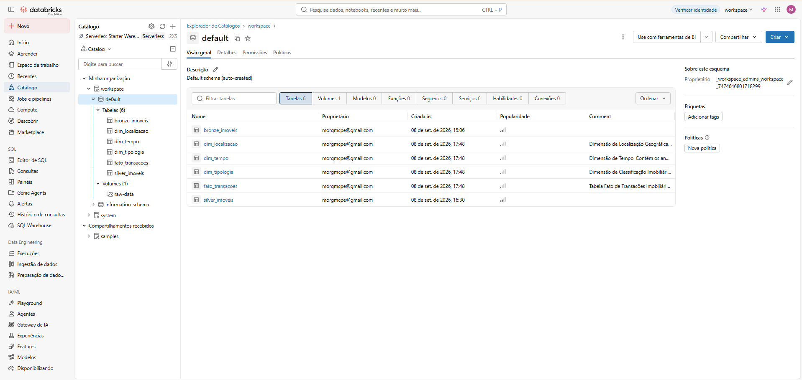

* **Dimensão Localização (dim_localizacao)**
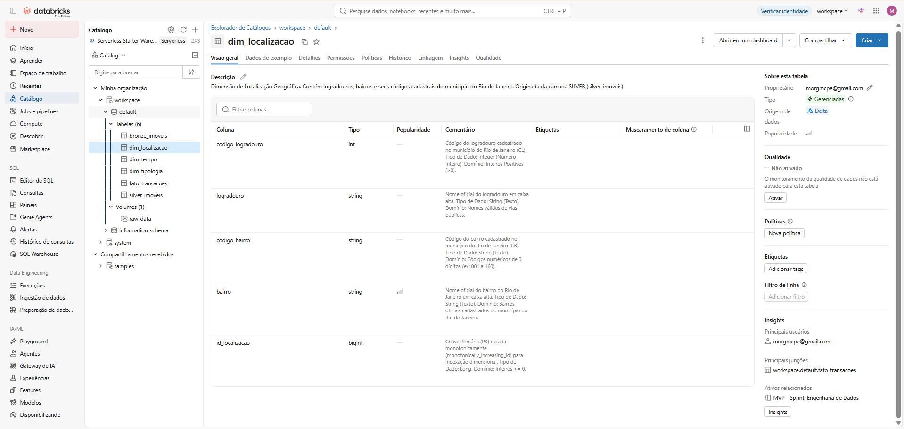

* **Dimensão Tipologia (dim_tipologia)**
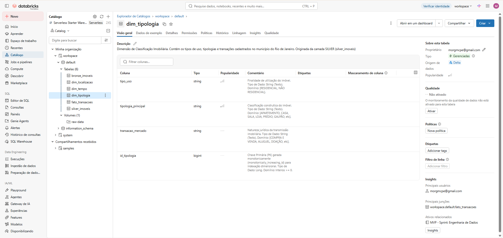

* **Dimensão Tempo (dim_tempo)**
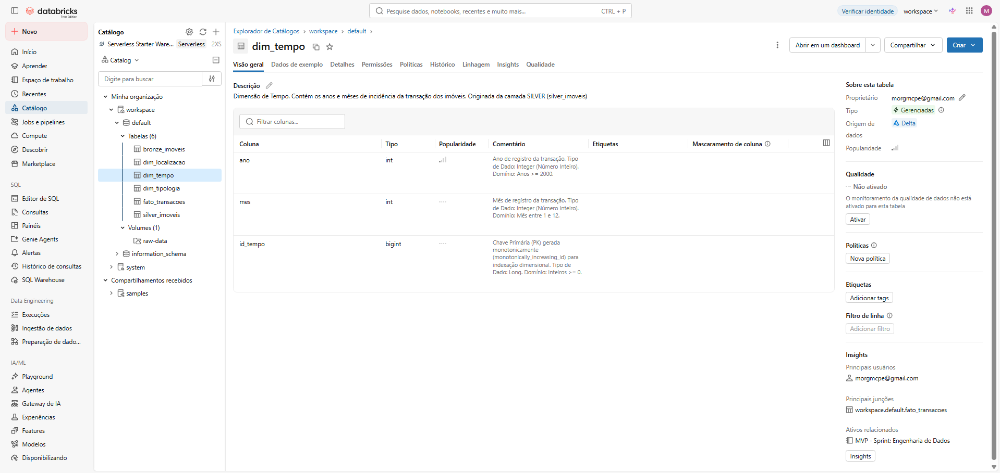

* **Tabela Fato Transações (fato_transacoes)**
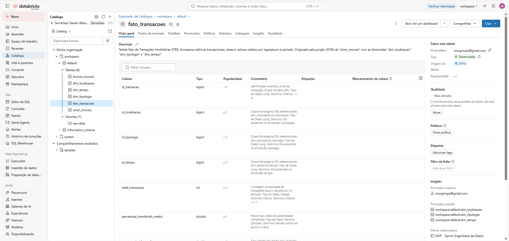

## 4. Pipeline de Dados (Etapa 4.4)

### 4.1. Estrutura e Organização do Pipeline 

O fluxo de engenharia de dados (ETL) foi projetado e orquestrado inteiramente de forma sequencial em um único **Notebook DataBricks**, aproveitando ao máximo a execução distribuída do Apache Spark e o Unity Catalog.

#### Etapa 1 - Camada Bronze ('bronze_imoveis')

Assim como explicado no **Tópico 2 (Carga dos Dados)**, a camada Bronze fica responsável por armazenar os dados em seus **estados brutos**, **originais**, em formato Delta Lake, com a adição de metadados de auditoria ('ingestao' e 'arquivo').

<h4 id="camada-silver">Etapa 2 - Camada Bronze $\rightarrow$ Camada Silver ('silver_imoveis')</h4>

Na transição para a segunda camada da **Arquitetura Medalhão**, a **Camada Silver**, os dados em seu estado bruto (raw) foram submetidos a rotinas de validação de qualidade, tipagem e saneamento sintático: 
* **Padronização Textual:** Foram utilizadas as funções **'upper()'** e **'trim()'** nos campos: "logradouro", "bairro", "uso", "tipologia", "principais_tipologias" e "principal_transação_mercado", padronizando variações de caixa alta e eliminando espaços.
* **Tipagem dos Dados:** Conversão do tipo de dado de colunas ingeridas originalmente como texto (string) para seus tipos primitivos:
  * 'cl' $\rightarrow$ 'Integer (Inteiro)'
  * 'ano_transação' e 'mês_transação' $\rightarrow$ 'Integer (Inteiro)'
  * 'total_transações' $\rightarrow$ 'Integer (Inteiro)'
  * 'média_percentual_transferido', 'média_área_construída', 'média_valor_transação' e 'média_valor_imóvel' $\rightarrow$ 'Double (Decimal)'
* **Renomeação Semântica:** Foram renomeados todos os atributos, removendo acentos e caracteres especiais existentes na base de dados original.
* **Tratamento de Valores Nulos:** Realização de uma análise diagnóstica e **descarte de 4 registros encontrados com valores nulos na coluna "média_valor_imóvel"**.

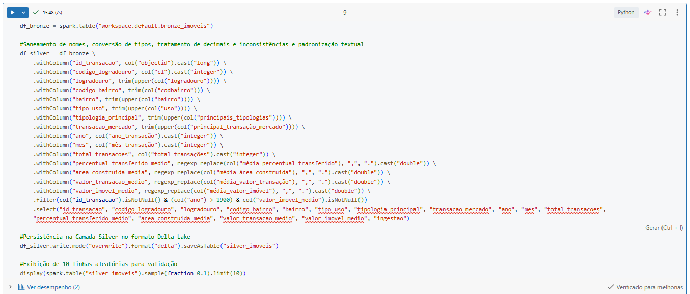
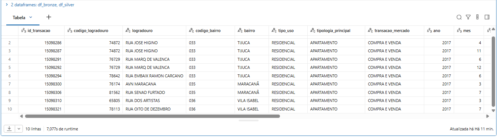

#### Etapa 3 - Camada Silver $\rightarrow$ Camada Gold (Modelagem Dimensional - Dimensões e Tabela Fato)

A camada Gold foi desnormalizada a partir do Dataframe tratado da camada Silver, criando assim as dimensões "dim_localizacao", "dim_tipologia" e "dim_tempo" e a tabela fato "fato_transacoes":
* Nas dimensões houve a seleção de atributos específicos para cada subconjunto, assim como a eliminação de duplicidades ('distinct()') e a criação de chaves primárias artificiais através do comando 'monotonically_increasing_id()'.
* Já na tabela fato foi executada uma junção (JOIN) entre o conjunto transacional da camada Silver (atributos não distribuidos entre as dimensões) e as três dimensões criadas, tendo uma tabela fato com as chaves estrangeiras (FKs) e as métricas transacionais.

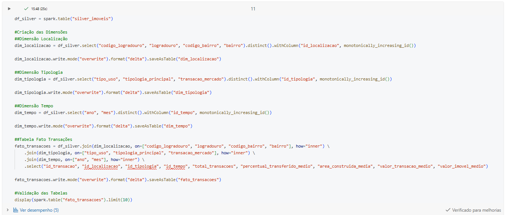
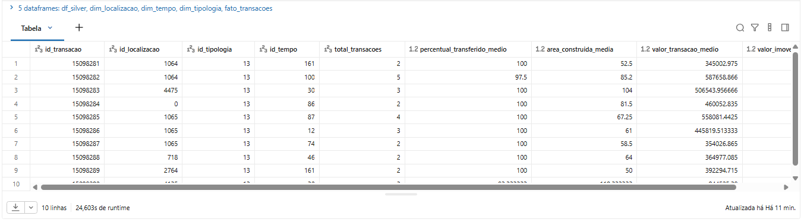

### 4.2. Persistência no Lakehouse (Delta Lake)

Todas as tabelas foram persistidas em formato **Delta Lake**, assegurando garantias ACID e alta performance de consulta no Unity Catalog.

### 4.3. Referência ao Script no Repositório

## 5. Qualidade de Dados (Etapa 4.5)

Após a persistência da tabela original na **Camada Bronze** e antes de realizar o processo de limpeza e transformação na **Camada Silver**, foi executada uma etapa de diagnóstico para avaliar a qualidade dos dados brutos, tendo como objetivo auditar a **Unicidade**, **Completude** e **Consistência e Tipagem**. Com isso em mente teve-se o seguinte relatório:
* **Unicidade:** O atributo identificador 'objectid' possui **97.467 registros únicos para um total de 97.467 linhas**, confirmando zero duplicatas de chave primária. 
* **Completude:** Identificou-se que praticamente todas as colunas estão íntegras, com exceção de **4 registros nulos/vazios** concentrados no atributo **'média_valor_imóvel'** (menos de 0,004% da base).
* **Consistência e Tipagem:** Constatou-se a necessidade de **conversão dos tipos primitivos** (de texto para inteiros e decimais com ponto), **padronização textual em maiúsculas** e **saneamento dos nomes das colunas**.

Os problemas detectados com relação a completude e consistência e tipagem foram tratados na camada Silver, como mostrado na seção anterior [4. Pipeline de Dados, Tópico 4.1, Etapa 2](#camada-silver).

#### 5.1. Diagnóstico realizado

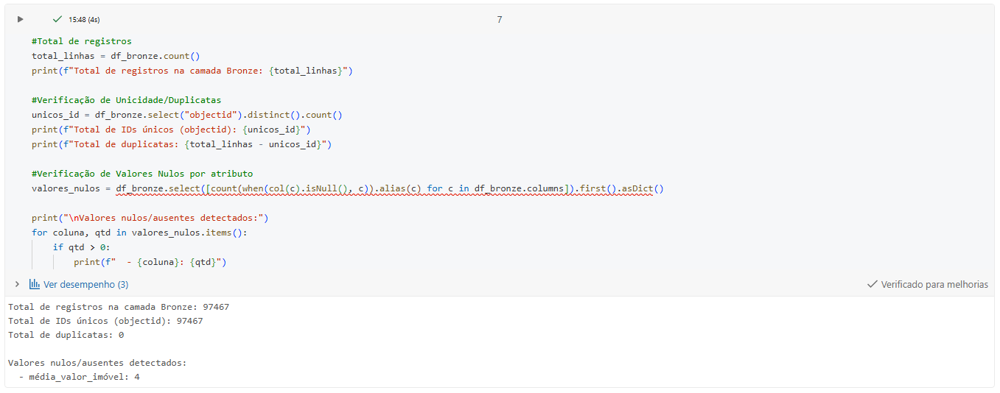

### 5.2. Referência ao Script no Repositório

## 6. Análise de Dados (Etapa 4.5)

Com a Arquitetura Medalhão projetada por completo e a camada Gold consolidada em arquitetura dimensional (Esquema Estrela), foram realizadas consultas analíticas na linguagem SQL para responder as perguntas formuladas no início do projeto na [etapa 1](#Perguntas).

### 6.1. Pergunta 1 - **Quais são os 10 bairros com maior volume de transações registradas no município do Rio de Janeiro?**

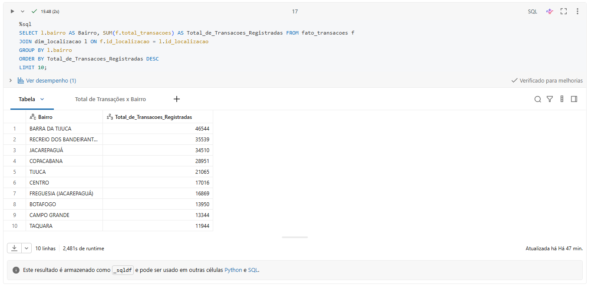
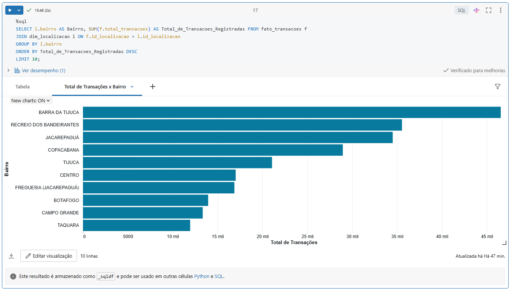

A partir da consulta realizada, foi possível extrair conclusões consistentes sobre a dinâmica imobiliária do município. Foi identificado que o bairro da **Barra da Tijuca** lidera de forma isolada, acumulando mais de 45 mil transações registradas, sendo seguido por **Recreio dos Bandeirantes** e **Jacarepaguá**, formando assim o top 3. Além dos 3 citados, bairros como **Freguesia (Jacarepaguá)**, **Campo Grande** e **Taquara** também entram entre os 10 bairros com maior volume transacional no Rio de Janeiro, evidenciando liderança absoluta da **Zona Oeste** da cidade. 

Ademais, observa-se que bairros consolidades e mais tradicionais como **Copacabana** (~29 mil), **Tijuca** (~21 mil) e **Botafogo** (~14 mil) também se destacam ficando entre os top 10 maiores polos, refletindo assim um mercado secundário contínuo e resiliente.

O bairro do **Centro** também consta no ranking, o que pode indicar que boa parte do mercado imobiliário inclui o polo comercial/corporativo.

#### Referência ao Script

### 6.2. Pergunta 2 - **Quais são os 10 bairros com o valor médio de transação imobiliária mais elevado?**

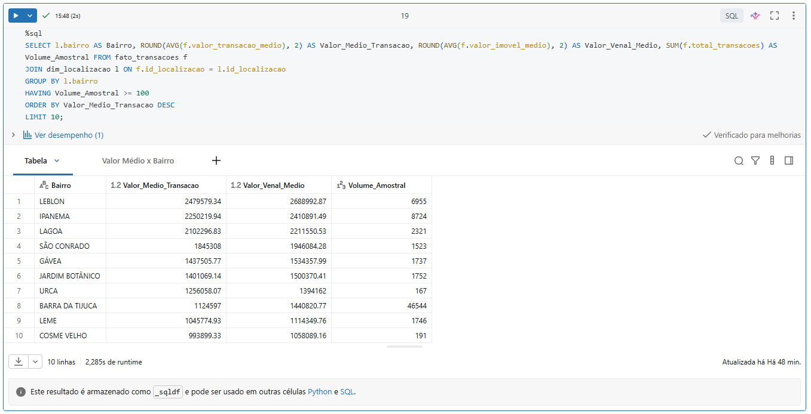
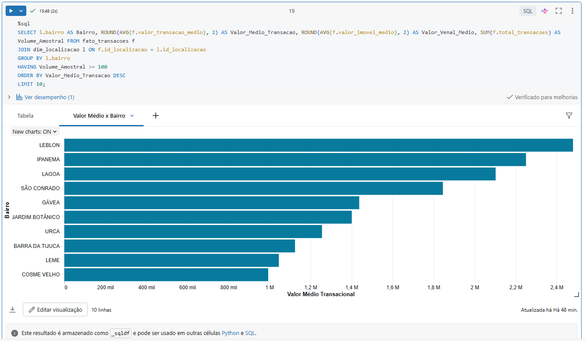

Os bairros da **Zona Sul** dominam expressivamente o ranking de valorização. O **Leblon** desponta na primeira posição com o valor transacional médio mais alto da cidade (R$ 2.479.579,34), seguido por **Ipanema** (R$2.250.219,94) e **Lagoa** (R$ 2.102.296,83). Completam a lista **São Conrado** (R$ 1,84M), **Gávea** (R$ 1,43M), **Jardim Botânico** (R$ 1,40M), **Urca** (R$ 1,25M), **Leme** (R$ 1,04M) e **Cosme Velho** (R$ ~1M), demonstrando a hegemonia e o alto poder aquisitivo dessa região da cidade.

É interessante pontuar que o bairro da **Barra da Tijuca** também aparece nesse ranking, ocupando a 8ª posição, com valor médio de R$ 1.124.597,00, destacando-se como único bairro que combina valor de transação elevado com volume transacional expressivo (46,5 mil), enquanto os bairros da Zona Sul mantém volumes expressivamente mais restritos - sendo **Ipanema** o mais próximo, com aproximadamente 9 mil transações. 

#### Referência ao Script

### 6.3. Pergunta 3 - **Como o volume e o montante financeiro das transações imobiliárias evoluíram historicamente ano a ano no Rio de Janeiro?**

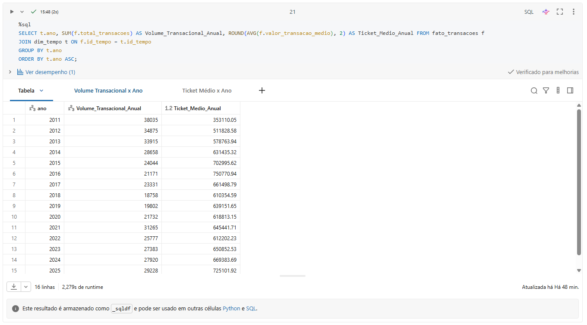
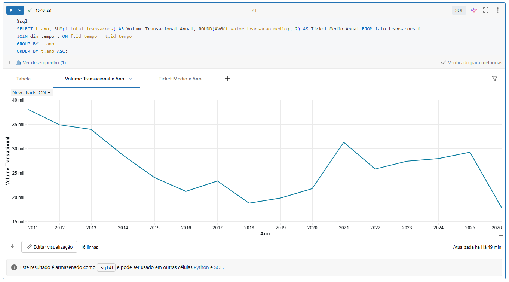
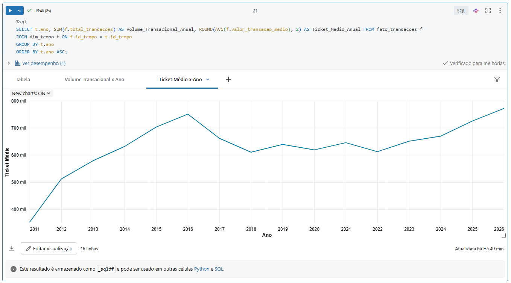

A análise histórica da séria temporal (2011 - 2025) revela ciclos econômicos bem definidos no mercado imobiliário carioca, com dinâmicas contrastantes entre volume e tíquete médio.

* **2011 - 2016:** No início da série estão presentes os maiores volumes transacionais da década, sendo o ápice, **38.035 transações em 2011**. Nos anos posteriores, observou-se uma **desaceleração progressiva na quantidade de negócios**, caindo para **21.171 em 2016**, enquanto o **tíquete médio anual dobrou**, saltando de **R$ 353.110,05 (2011)** para o pico histórico de **R$ 750.770,94 (2016)**. Esses valores refletem uma valorização patrimonial expressiva, que pode ser explicada por altos investimentos urbanos e grandes eventos na cidade.
* **2017 - 2020:** Entre 2017 e 2020, o mercado enfrentou uma **contração tanto em liquidez quanto em valores médios**, atingindo o **menor volume da série em 2018 (18.758 transações)** e uma **correção no tíquete médio para valores próximos a R$ 610 mil - R$ 639 mil**.
* **2021 - 2025:** Em 2021, é notável um forte repique no **volume transacional com 31.265 transações**, estimulado pelo período de taxas de juros historicamente baixas no país. De 2022 em diante, o mercado imobiliário consolidou uma constante expansão, onde o volume subiu progressivamente ano a ano de **25.777 para 29.228 (2025)**, acompanhado por um novo nível de valorização do tíquete médio, que encerrou **2025 com R$ 725.101,92**.

#### Referência ao Script

### 6.4. Pergunta 4 - Qual tipologia construtiva (Apartamento, Casa, Loja) e finalidade de uso (Residencial vs. Comercial) dominam o mercado imobiliário carioca?

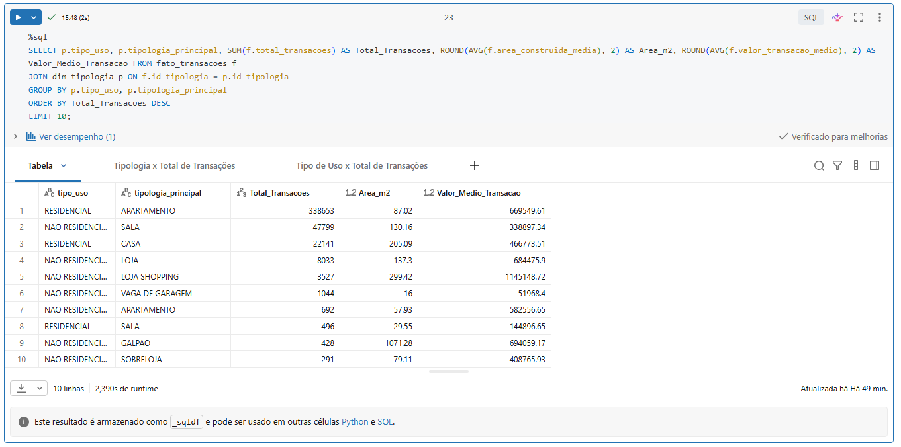
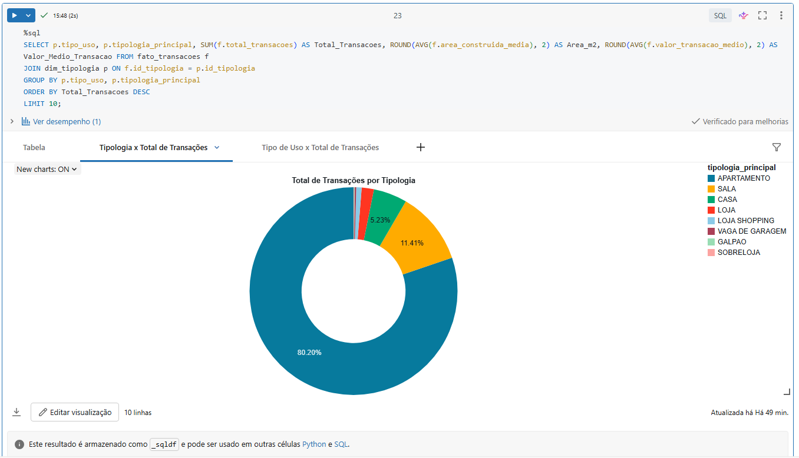
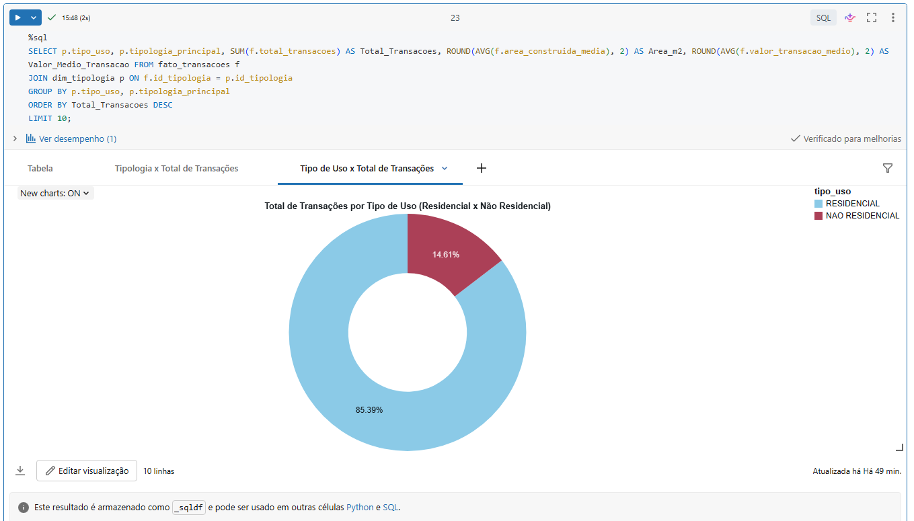

Por meio da consulta realizada, pode-se concluir que a tipologia e tipo de uso **Apartamento (Residencial)** domina o mercado com **338.653 transações** registradas, representando a maioria das operações imobiliárias na cidade. Esse padrão reflete um processo consolidado de verticalização urbana, acompanhado pelo crescimento demográfico, na capital, apresentando área média de **87,02 m²** e tíquete médio de **R$ 669.549,61**.

Quando comparamos a tipologia **Casa (Residencial)** com **Apartamento (Residencial)**, temos que a primeira ocupa a terceira posição geral com **22.141 transações**. Embora as casas tenham mais que o dobro da metragem média dos apartamentos (**205,09 m² contra 87,02 m²**), o seu tíquete médio geral (**R$ 466.773,51**) e o valor por metro quadrado (**~R$ 2.275/m²**) são muito inferiores aos dos apartamentos (**~R$ 7.694/m²**). Desta maneira, comprova-se que a maior parte da liquidez de casas está concentrada em bairros da Zona Norte e Zona Oeste de menor valor venal por metro quadrado, enquanto os apartamentos se concentram em regiões verticalizadas de maior valor agregado como os bairros da Zona Sul e Barra da Tijuca.

Ademais, temos que o segmento **não residencial** possui forte representatividade, liderado por **Salas Comerciais**, que acumulam **47.799 transações**, sendo o segundo maior no total de transações imobiliárias no município, com tíquete médio de **R$ 338.897,34** para uma área média de **130,16 m²**, operando com um custo por metro quadrado acessível (**~R$ 2.603/m²**). Em contrapartida, observa-se que as **Lojas de Shopping** concentram o maior valor financeiro de todos os segmentos, com valor médio transacional de **R$ 1.145.148,72** para uma área média de **299,42 m²**.

#### Referência ao Script

### 6.5. Pergunta 5 - Qual é o valor médio transacionado de apartamentos residenciais nos bairros que concentram o maior volume de vendas dessa categoria?

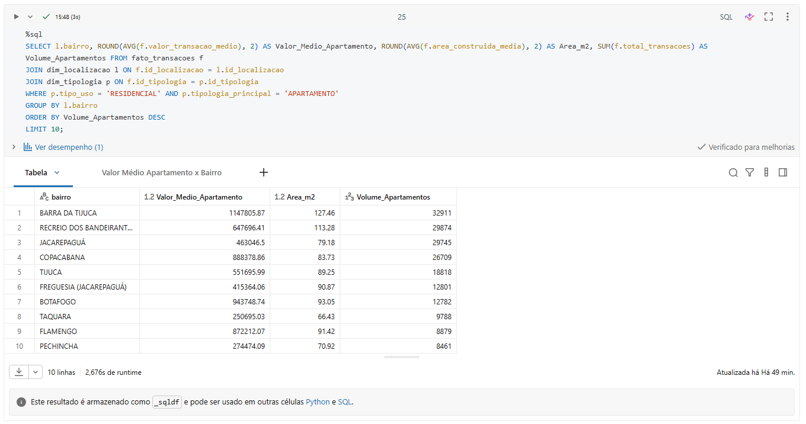
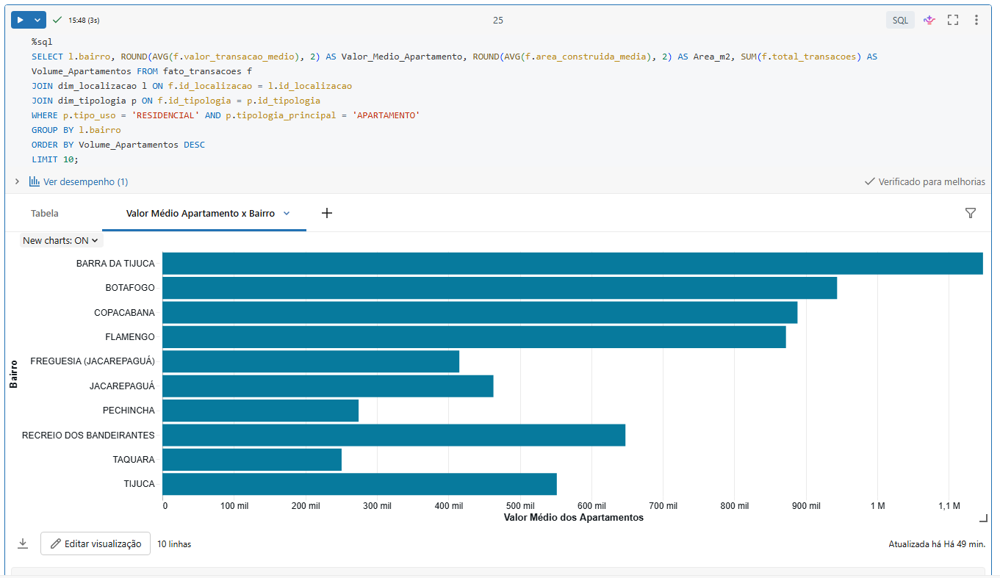

A partir da análise, observa-se que os bairros da **Zona Oeste** lideram expressivamente o volume absoluto de vendas de apartamentos residenciais. O topo do ranking é composto por **Barra da Tijuca** (32.911 transações), **Recreio dos Bandeirantes** (29.874) e **Jacarepaguá** (29.745), que somados ultrapassam 92 mil transações dessa tipologia. Contudo, há uma **disparidade financeira** evidente entre eles: enquanto a Barra atinge um valor médio de **R$ 1.147.805,87**, Recreio e Jacarepaguá atendem faixas mais intermediárias de mercado, registrando valores médios de **R$ 647.696,41** e **R$ 463.046,50**, respectivamente.

Outros bairros da Zona Oeste, como **Freguesia (Jacarepaguá)** (12.801 transações e **R$ 415.364,06**), **Taquara** (9.788 transações e **R$ 250.695,03**) e **Pechincha** (8.461 transações e **R$ 274.474,09**), além da **Tijuca** na Zona Norte (18.818 transações e **R$ 551.695,99**), apresentam volumes transacionais e valores médios mais contidos quando comparados ao topo da lista. Esses bairros atendem à demanda residencial de perfil intermediário e mais acessível da capital. 

Por outro lado, os bairros tradicionais da **Zona Sul** presentes no top 10 - **Copacabana** (26.709 transações e valor médio de **R$888.378,86**), **Botafogo** (12.782 transações e **R$ 943.748,74**) e **Flamengo** (8.879 transações e **R$ 872.212,07**) - apresentam valores expressivamente maior que os demais, explicado pela alta valorização patrimonial e consolidação histórica da região.

#### Referência ao Script

## 7. Autoavaliação

